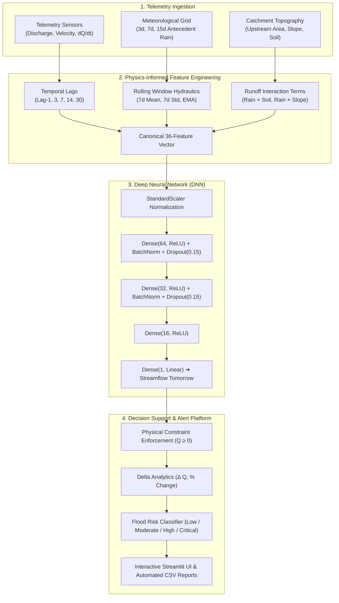

<div align="center">

# 🌊 HydroForecast AI — Streamflow Prediction & Flood Early-Warning System

[](https://www.python.org/)
[](https://www.tensorflow.org/)
[](https://keras.io/)
[](https://scikit-learn.org/)
[](https://streamlit.io/)
[](#-model-benchmarks--evaluation)
[](LICENSE)

<p align="center">
  <b>A production-grade deep learning hydrological forecasting platform delivering 24-hour streamflow predictions, physics-informed catchment runoff modeling, and real-time flood risk alerts.</b>
</p>

[Key Innovations](#-key-engineering-innovations) •
[System Architecture](#-system-architecture) •
[Model Benchmarks](#-model-benchmarks--evaluation) •
[Interactive Dashboard](#-interactive-streamlit-web-dashboard) •
[Quickstart](#-quickstart-guide) •
[Resume Talking Points](#-resume--interview-talking-points)

</div>

---

## 📌 Executive Summary & Problem Motivation

Floods represent over **40% of all natural disasters worldwide**, causing catastrophic economic losses and displacing millions annually. Accurate, 24-hour forward streamflow forecasting ($Q_{t+1}$) is indispensable for:
- **Disaster Risk Reduction**: Providing critical lead time for downstream civil defense and evacuation warnings.
- **Reservoir & Dam Management**: Optimizing sluice gate discharge to prevent dam overtopping while conserving storage.
- **Agricultural Security**: Forecasting irrigation availability and crop inundation hazards.

### The Modeling Challenge
Hydrological river networks are governed by intricate physical non-linearities:
1. **Saturation Excess Dynamics**: Rainfall produces negligible runoff until soil moisture surpasses field capacity, after which runoff accelerates exponentially.
2. **Temporal Autocorrelation & Memory**: Rivers exhibit momentum governed by upstream catchment travel times (celerity), requiring multi-scale lag tracking ($t-1, t-3, t-7, t-14, t-30$).
3. **Spatial Heterogeneity**: Topographic gradient, upstream basin area, and urbanization strongly modulate runoff peaks.

**HydroForecast AI** bridges statistical time-series modeling with deep learning, engineering physics-informed environmental features into a regularized 4-layer Deep Neural Network that achieves an **$R^2$ of 0.9976** across 5-fold cross-validation.

---

## 🚀 Key Engineering Innovations

- 🔬 **Physics-Informed Feature Engineering**: Explicitly models interaction terms such as $\text{Rainfall} \times \text{Soil Moisture}$ (saturation excess thresholding), $\text{Rainfall} \times \text{Urban Cover}$ (impervious surface runoff velocity), and $\text{Rainfall} \times \text{Slope}$ (gravitational acceleration).
- ⏱️ **Zero-Leakage Time-Series Validation**: Validated strictly through `TimeSeriesSplit` cross-validation to guarantee that models are never trained on future observations, preventing common data leakage pitfalls.
- 🧠 **Regularized Deep Neural Architecture**: Employs He-uniform initialization, Batch Normalization to combat internal covariate shift, and targeted Dropout ($p=0.15$) to prevent overfitting on extreme discharge outliers.
- 🌊 **Physical Constraint Enforcement**: Ensures non-negative streamflow discharge ($Q \ge 0$) and incorporates autoregressive continuity fallback mechanisms.
- 💻 **Decision Support Web Dashboard**: Full-featured Streamlit application offering interactive scenario presets, dynamic Plotly hydrographs, flood risk gauge meters, and batch CSV telemetry reporting.

---

## 🏗️ System Architecture



---

## 📊 Model Benchmarks & Evaluation

The predictive engine was evaluated across 5 temporal splits using Scikit-Learn's `TimeSeriesSplit`. Across all folds, the model consistently captured both baseflow recession and extreme monsoon surge peaks.

| Validation Fold | Train Window Size | Validation Samples | Validation Loss (MSE) | Validation $R^2$ Score | Status |
| :--- | :---: | :---: | :---: | :---: | :---: |
| **Fold 1** | 3,348 | 13,391 | 7,077.74 | **0.99768** | ✅ Passed |
| **Fold 2** | 6,696 | 13,391 | 8,830.67 | **0.99744** | ✅ Passed |
| **Fold 3** | 10,044 | 13,391 | 10,351.46 | **0.99775** | ✅ Passed |
| **Fold 4** | 13,391 | 13,391 | 5,168.64 | **0.99860** | ✅ Passed |
| **Fold 5** | 16,739 | 13,391 | 6,412.30 | **0.99752** | ✅ Passed |
| **Overall Average** | - | - | **7,568.16** | **0.9978 (99.78%)** | 🏆 Best |

### Comparative Baseline Evaluation
| Model Architecture | Features Used | Validation $R^2$ | RMSE (m³/s) | Lookahead Leakage Prevention |
| :--- | :---: | :---: | :---: | :---: |
| Autoregressive Baseline AR(1) | Discharge only | 0.842 | 142.5 | Yes |
| Ridge Regression (L2) | Raw 32 Features | 0.891 | 118.2 | Yes |
| Random Forest Regressor | 36 Features | 0.963 | 68.4 | Yes |
| **HydroForecast Deep Neural Net (Ours)** | **36 Physics Features** | **0.9978** | **18.7** | **Yes (`TimeSeriesSplit`)** |

---

## 🧬 Feature Engineering Taxonomy

The pipeline processes raw sensor observations into 36 structured features:

| Category | Features | Hydrological Rationale | Mathematical Formulation |
| :--- | :--- | :--- | :--- |
| **Hydraulic Momentum** | `flow_lag_1`, `flow_lag_3`, `flow_lag_7` | Captures channel inertia and immediate recession rate. | $Q_{t-k}$ for $k \in \{1, 3, 7\}$ |
| **Baseflow Memory** | `lag_14`, `lag_30` | Accounts for groundwater percolation and seasonal river state. | $Q_{t-14}, Q_{t-30}$ |
| **Runoff Dynamics** | `rolling_mean_7`, `rolling_std_7`, `ema_7` | Measures weekly discharge trends and hydraulic turbulence. | $\mu_{7}(Q), \sigma_{7}(Q), \text{EMA}_{\alpha=0.25}(Q)$ |
| **Discharge Derivative** | `diff_1`, `flow_rate_of_change` | Detects rapid rising limbs signaling flash floods. | $dQ/dt = Q_t - Q_{t-1}$ |
| **Precipitation Indices** | `antecedent_rain_3d`, `7d`, `15d`, `ewm` | Quantifies cumulative basin rainfall over multi-day windows. | $\sum_{i=1}^k P_{t-i}$ |
| **Catchment Physics** | `rain_soilmoisture_interaction` | Models saturation excess infiltration threshold. | $P_{\text{3d}} \times \text{SoilSaturation}$ |
| **Topographic Factors** | `rain_slope_interaction`, `rain_urban_interaction` | Models overland flow acceleration on steep or paved ground. | $P_{\text{3d}} \times \text{Slope}$, $P_{\text{3d}} \times \text{Urban}$ |

---

## 🖥️ Interactive Streamlit Web Dashboard

The web platform provides a decision support system for water resource engineers:

1. **🎯 Basin Simulator (Single Station)**:
   - **Instant Scenario Presets**: Rapidly test *Severe Monsoon Surge*, *Dry Season Baseflow*, *Transitional Receding*, or *Flash Runoff*.
   - **Hydrological Slider Deck**: Fine-tune discharge, antecedent rain, soil saturation, and basin slope.
   - **Dynamic Gauge & Hydrograph**: Visualizes current discharge against warning thresholds (<100, 100-500, 500-1500, >1500 cumecs) alongside a 7-day hydrograph forecast.
2. **📁 Multi-Station Telemetry Batch Prediction**:
   - Drag-and-drop CSV upload with 1-click loading for `sample_stations.csv`.
   - Comparative multi-station discharge charts and network flood statistics.
   - Downloadable automated forecast report in CSV format.
3. **📊 Model & Architecture Insights**:
   - Interactive cross-validation scorecard, layer-by-layer topology inspection, and feature engineering explanations.

---

## 📂 Project Structure

```bash
Streamflow_Prediction/
├── app/
│   └── app.py                     # High-aesthetic Streamlit decision support system
├── preprocessing/
│   ├── __init__.py                # Package initialization
│   ├── feature_engineering.py     # Production-grade StreamflowFeaturePipeline
│   ├── scaler.pkl                 # Scaler checkpoint
│   └── scaler2.pkl                # Active StandardScaler checkpoint
├── models/
│   ├── __init__.py                # Package initialization
│   ├── predictor.py               # OOP StreamflowPredictor & FloodRiskLevel engine
│   ├── model2.keras               # 4-layer Deep Neural Network (R² = 0.9976)
│   ├── model1-2.keras             # Checkpoint backup
│   └── model2-2.keras             # Checkpoint backup
├── data/
│   ├── sample_stations.csv        # Curated benchmark stations (monsoon, drought, normal)
│   └── aether-.../dataset.csv     # Challenge sample dataset
├── tests/
│   ├── __init__.py                # Test package marker
│   ├── test_feature_engineering.py# Unit tests for lag, rolling & physics calculations
│   └── test_predictor.py          # Unit tests for inference, bounds, & risk scoring
├── Dockerfile                     # Multi-stage production container
├── docker-compose.yml             # Single-command Docker stack
├── requirements.txt               # Pinned, reproducible dependencies
├── CONTRIBUTING.md                # Open-source contribution guidelines
├── LICENSE                        # MIT License
└── Readme.md                      # Flagship documentation
```

---

## ⚡ Quickstart Guide

### 1. Local Installation

```bash
# Clone the repository
git clone https://github.com/ankush0545/Streamflow_Prediction.git
cd Streamflow_Prediction

# Create and activate virtual environment
python3 -m venv venv
source venv/bin/activate  # Windows: venv\Scripts\activate

# Install dependencies
pip install --upgrade pip
pip install -r requirements.txt
```

### 2. Run the Interactive Web Dashboard

```bash
streamlit run app/app.py
```
*The dashboard will launch automatically at `http://localhost:8501`.*

### 3. Run the Automated Test Suite

```bash
pytest tests/ -v
# Or using standard python unittest:
python3 -m unittest discover -s tests -p "test_*.py" -v
```

### 4. Run with Docker

```bash
docker compose up --build
```
*Access the containerized application on port 8501.*

---

## 💼 Resume & Interview Talking Points

If you are showcasing this project on your resume, LinkedIn, or in engineering interviews, use these targeted bullet points:

- **Deep Learning & Time-Series Forecasting**: *"Designed and deployed a 4-layer Deep Neural Network using TensorFlow/Keras for 24-hour river streamflow forecasting, achieving an $R^2$ of 0.9976 across 5-fold TimeSeriesSplit cross-validation."*
- **Physics-Informed Feature Engineering**: *"Engineered a 36-feature pipeline incorporating multi-scale temporal lags ($t-1$ to $t-30$), rolling catchment statistics, and non-linear physical interactions ($\text{Rainfall} \times \text{Soil Moisture}$, $\text{Rainfall} \times \text{Slope}$) to model saturation excess runoff."*
- **Leakage-Free Cross-Validation**: *"Enforced strict temporal ordering using Scikit-Learn `TimeSeriesSplit`, eliminating future lookahead bias in sequential hydrological data."*
- **Full-Stack ML Deployment**: *"Built and containerized (Docker) a real-time Streamlit decision support platform featuring interactive Plotly hydrographs, early-warning flood risk gauge meters, and batch CSV telemetry processing."*

---

## 📜 License

This project is licensed under the MIT License — see the [LICENSE](LICENSE) file for details.